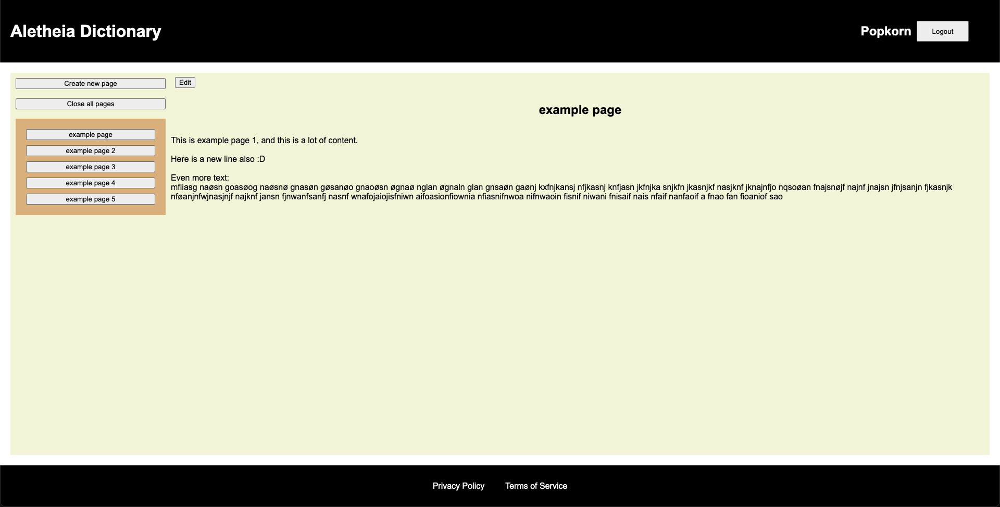
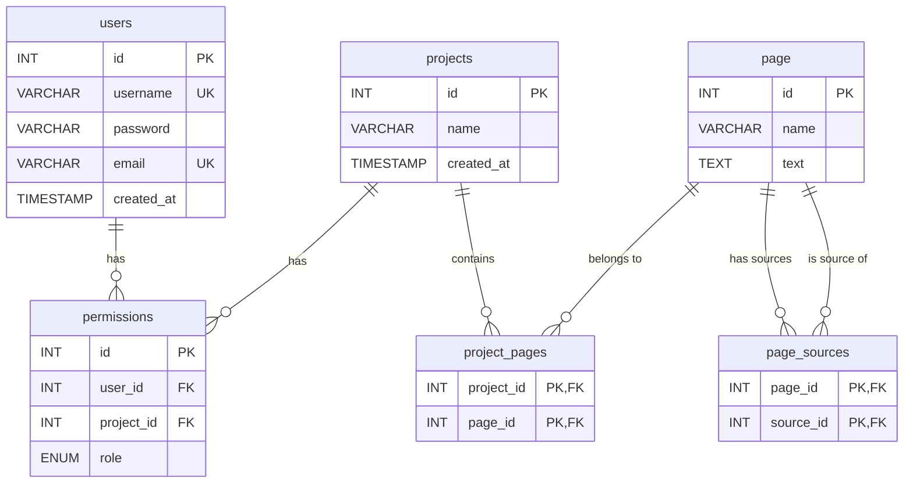
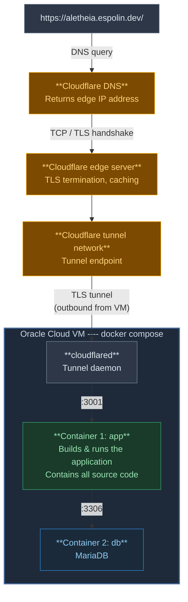

# Aletheia Dictionary

An open-source website built for a deeper exploration of thoughts and ideas with personal wiki-like projects, linking ideas together with a network of sources and backlinks.

 *Image of project page with some pages*

### Privacy Policy
https://aletheia.espolin.dev/privacy_policy

### Terms of Service
https://aletheia.espolin.dev/terms_of_service


## Collaboration

You are free to make pull requests with new features, fixes, or changes. These will be carefully reviewed and accepted or denied based on my own judgement. Malicious pull requests will be followed up on and result in a permanent ban on the people involved.

Please follow these guidelines when contributing:

- Open an issue before starting significant work, so we can discuss the approach first.
- Keep commits focused and write clear commit messages.
- Match the existing code style of the project.
- Branch names should be descriptive

## Prerequisites

Make sure you have the following installed before getting started with local development:

- **Node.js** v20 or higher (and npm)
- **Git**
- **Docker** (for the Docker setup)
- **MariaDB** (for the npm dev setup)

## Local development

To make contributions to the project, you must first clone and enter the repository:

```bash
git clone https://github.com/PopkornXD/Aletheia-Dictionary.git
cd Aletheia-Dictionary
```

Then you need to create a `.env` file following this structure:

```bash
DB_HOST=127.0.0.1        # Keep this at localhost
DB_USER=username         # Any username
DB_PASSWORD=password     # Any password
DB_NAME=aletheia         # Any database name
DB_ROOT_PASSWORD=secure_password  # Root password used only in the Docker setup
ORIGIN=http://localhost:3001      # Must match the port your server runs on.
                                  # SvelteKit uses this for CSRF/origin protection.
                                  # Use port 3001 for Docker, or 5173 for npm dev.
```

You can now run the website, either with **Docker** or with **npm** (or both).

> **Note:** Docker runs the site on port `3001`, while `npm run dev` runs it on port `5173`. These are two independent setups — pick whichever suits your workflow.

### Docker setup

Install **Docker** if you have not already, and then simply run:

```bash
docker compose up
```

The website should now be running at http://localhost:3001/, as long as you have not changed the port in `docker-compose.yml`.

### npm development setup

To get live updates on the website during development, you can use **npm** to run it. This requires a local **MariaDB** instance.

If you do not have MariaDB installed yet, install it first, then run the secure setup script to set a root password:

```bash
sudo mysql_secure_installation
```

Log in as root and create a user and database matching your `.env` file:

```bash
sudo mysql -u root -p
```

```sql
CREATE DATABASE aletheia;
CREATE USER 'username'@'localhost' IDENTIFIED BY 'password';
GRANT ALL PRIVILEGES ON aletheia.* TO 'username'@'localhost';
FLUSH PRIVILEGES;
EXIT;
```

Now run the schema to set up the tables:

```bash
mysql -u username -p aletheia < src/lib/sql/schema.sql
```

Then install dependencies and start the dev server:

```bash
npm install
npm run dev
```

The website should now be running at http://localhost:5173/.

## Tech stack

| Layer | Technology |
|---|---|
| Frontend | SvelteKit, Svelte 5 |
| Backend | SvelteKit server-side routes |
| Database | MariaDB (MySQL) |
| Deployment | Docker containers on Oracle Cloud VM with Cloudflare tunnel |

## Data structure

The `permissions` table uses a `role` enum with the following values: `viewer`, `editor`, `admin`.

Pages can act as sources for other pages. The `page_sources` table captures this relationship, both `page_id` and `source_id` reference the `page` table.



## Deployment system overview



## License

This project is licensed under the [GNU AFFERO GENERAL PUBLIC LICENSE](LICENSE).